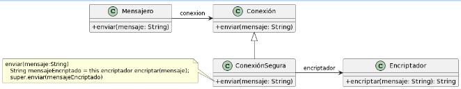

Ejercicio 10: Encriptador

- En un sistema de mensajes instantáneos (como WhatsApp) se envían mensajes de una máquina a otra a través de una red. Para asegurar que la información que pasa por la red no es espiada, el sistema utiliza una conexión segura. Este tipo de conexión encripta la información antes de enviarla y la desencripta al recibirla. La siguiente figura ilustra un posible diseño para es
  te enunciado.

- El encriptador utiliza el algoritmo RSA. Sin embargo, se desea agregar otros algoritmos (diferentes algoritmos ofrecen distintos niveles de seguridad, overhead en la transmisión, etc.).

- El encriptador utiliza el algoritmo RSA. Sin embargo, se desea agregar otros algoritmos (diferentes algoritmos ofrecen distintos niveles de seguridad, overhead en la transmisión, etc.).

Tareas:

- Modifique el diseño para que el objeto Encriptador pueda encriptar mensajes usando los algoritmos Blowfish y RC4, además del ya soportado RSA.

- Documente mediante un diagrama de clases UML indicando los roles de cada clase.
