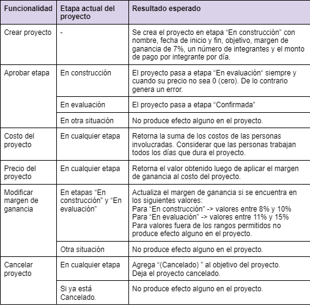

Ejercicio 11: Administrador de proyectos

- Consideremos una empresa que brinda servicios y los gestiona a través de proyectos. Los proyectos tienen una fecha de inicio y de fin, un objetivo, un número de integrantes (quienes cobran un monto fijo por día) y un margen de ganancia. Durante el armado del proyecto, el mismo debe pasar por un proceso de aprobación que involucra las etapas: En construcción -> En evaluación -> Confirmada. Se desea implementar la siguiente funcionalidad:



Tareas:

- 1- Modele una solución y provea el diagrama de clases UML para el problema planteado. Si utiliza algún patrón, indique cuál.

- 2- Implemente en Java.

- 3- Implemente un test para aprobar un proyecto con las siguientes características: 

(i) se encuentra en evaluación 

(ii) se llama “Vacaciones de invierno” 

(iii) tiene como objetivo “salir con amigos”, y 

(iv) lo integran 3 personas.

Nota: para generar o levantar un error debe utilizar la expresión

```java
throw new RuntimeException("Este es mi mensaje de error");
```
