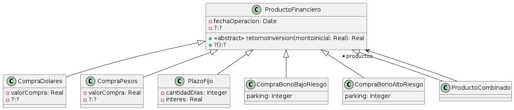
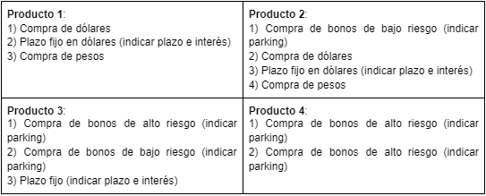

Ejercicio 17 - Productos Financieros

El banco ofrece los siguientes productos financieros a sus clientes:

- Compra de Dólares
- Compra de Pesos
- Plazo Fijo (requiere indicar plazo e interés diario)
- Compra de bonos de bajo riesgo (tienen una variación máxima del 10% y se debe indicar un plazo mínimo o parking)
- Compra de bonos de alto riesgo (tienen una variación máxima del 70% y se debe indicar un plazo mínimo o parking)

A menudo, el banco también innova creando nuevos productos financieros que son combinaciones de estos productos existentes.

Cuando se invoca el mensaje retornoInversión(), se indica un monto inicial, para que calcule y retorne el capital que se obtiene al invertir ese monto inicial.

Algunos de los productos que ofrece, son combinaciones de otros, como por ejemplo:

En el banco, cada cliente posee un tipo de membresía que determina sus beneficios. Contamos con dos niveles de membresía: Silver y Gold. Los clientes con membresía Silver tienen acceso exclusivo a los productos 1 y 2. Además, al realizar plazos fijos, disfrutan de una tasa del 5% y un plazo mínimo de 35 días. Asimismo, al comprar bonos, el periodo mínimo de parking es de 72 horas. Por otro lado, los clientes con membresía Gold reciben una tasa de plazo fijo del 6%, con un plazo mínimo de 30 días, y un periodo de parking de 24 horas.

Se sabe que el banco se esfuerza constantemente por lanzar nuevos productos para satisfacer aún más las necesidades de inversión de sus clientes.

Tareas:

Proponga una solución para que los desarrolladores no tengan que instanciar el Composite de Productos financieros explícitamente cada vez que sea necesario crear uno nuevo.
¿Qué ventaja y que desventaja tiene su solución?

Nota: Para simular el comportamiento de los bonos se puede generar un número aleatorio dentro del rango de variación máxima, reflejando la típica volatilidad del mercado financiero
