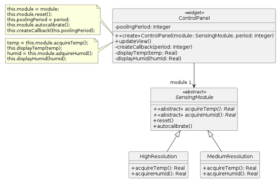
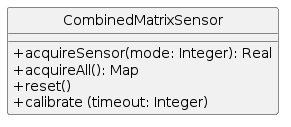

Ejercicio 18 - Sistema de monitoreo

Una empresa ha desarrollado un sistema de monitoreo de viveros que incluye: temperatura y humedad. Para realizar esta tarea se utilizan módulos que incluyen sensores para ambos temperatura y humedad. El sistema fue desarrollado utilizando una familia de módulos que tienen diferentes prestaciones y que tienen un protocolo en común.

Instancias de ControlPanel cumplen el rol de cliente de las instancias de alguna de las clases de la Jerarquía SensingModule (variable module). Por la manera en la que una instancia de ControlPanel es inicializada con un "pollingPeriod" (ver pseudocódigo del constructor de ControlPanel), la instancia de ControlPanel recibirá periódicamente el mensaje updateView(), lo cual hace que se envíen los mensajes apropiados al “module” asociado.

La empresa planea agregar un nuevo módulo que corresponda a uno de baja resolución (Low Resolution). Para implementar esto la empresa se propone adquirir un nuevo tipo de sensor cuya librería tiene el protocolo que muestra el diagrama de la clase CombinedMatrixSensor.

Las operaciones que implementa la CombinedMatrixSensor son:
acquireSensor(mode:Integer). El parámetro “mode” que indica que tipo de medición se realizará. El valor 1 es para temperatura y el valor 2 es para humedad.

acquireAll(), no tiene parámetros y retorna un HashMap con valores para temperatura (clave “temp”) y humedad (clave “hum”).
reset(), no tiene parámetros y resetea todos los sensores
calibrate(timeout:Integer), el parámetro “timeout” indica cuál es el tiempo máximo que el sensor puede demorar en ejecutar una lectura.

Tareas:

1. ¿Cuál es el principal problema que identifica en el enunciado?
2. ¿Qué patrón aplicaría para este problema y cuáles son las consecuencias de aplicarlo?
3. Presente el diseño resultante y especifique el código/pseudocódigo resultante
