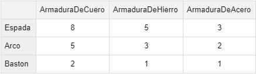

Ejercicio 19 - Personajes de juegos de rol

Una empresa de videojuegos ofrece personajes para sus juegos de rol. Cada personaje tiene un nombre y viene equipado con armaduras, armas, y habilidades únicas que les permiten desempeñarse mejor.
Las armaduras pueden ser de cuero, de hierro y de acero. Las armas pueden ser espadas, arcos y bastón de mago. Las habilidades pueden ser de combate cuerpo a cuerpo, de combate a distancia, de curación y de magia.
Actualmente ofrece 3 personajes: guerreros, arqueros y magos.

Los magos son expertos en el uso de la magia. Están equipados con una armadura de cuero para permitir la máxima movilidad. Su arma es un bastón mágico, y su habilidad es la magia y el combate a distancia. Los guerreros son los expertos en combate cuerpo a cuerpo, por lo tanto requieren una armadura de acero y una espada. Finalmente, los arqueros son especialistas tiros de flechas. Como deben moverse rápidamente, tienen una armadura de cuero y están equipados con arcos.

En el juego, los personajes tienen la posibilidad de enfrentarse entre sí. Durante un enfrentamiento, el resultado dependerá del arma que utilice el atacante y de la armadura que lleve el defensor. A continuación, se muestra una tabla con el daño que cada arma causa. Ese valor afecta el puntaje del jugador atacado.

Al inicio del juego, cada personaje comienza con 100 puntos de vida, los cuales se reducirán a medida que se enfrenten a otros jugadores. Un personaje podrá participar de un combate siempre que tenga vida.
Tareas:

1. Diseñe una solución orientada a objetos que permita la creación de personajes y el enfrentamiento entre ellos. Tenga en cuenta que en un futuro, la empresa planea ofrecer nuevos personajes. Provea el diagrama de clases UML y si utiliza algún patrón de diseño, indique cuál.
2. Implemente en Java el comportamiento descripto.
