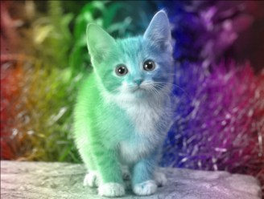
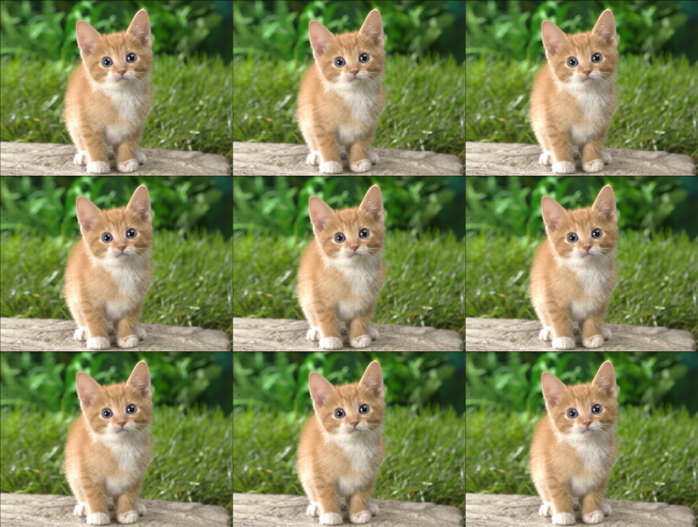
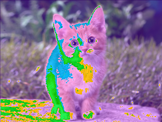

Ejercicio 20 - Filtros de Imágenes

En este proyecto encontrará la librería ImageFilter que implementa algunos filtros básicos sobre imágenes PNG tales como: Rainbow, Repeater y RGBShiter entre otros.
La librería incluye una herramienta (PNGFilterLauncher) que permite aplicar secuencia de filtros sobre una archivo de entrada y generar un archivo (.png) de salida.

Para probar el código, se deben configurar los argumentos de ejecución del proyecto. Se debe especificar la ubicación de la imagen de entrada y de salida, así como indicar qué filtros se van a aplicar.

img\input.png img\output.png --rainbow --artifacter

Tareas:

- Descargue el proyecto y pruebe los diferentes Filtros
- Analice el código y documente el proyecto con un Diagrama de Clases
- Evalúe cuál de los siguientes patrones mejor describe el diseño de los Filtros: TemplateMethod, Strategy, Decorator. Para realizar la evaluación se sugiere contestar las siguientes preguntas aplicadas a cada uno de los patrones:
  - ¿El objetivo del patrón se distingue en el diseño? Elabore en un párrafo.
  - ¿La estructura del proyecto coincide con la estructura y los participantes del patrón? Elabore en un párrafo.
  - En el caso que el patrón coincida, puede distinguir un “smell” o algo que se aleja del patrón presentado en el libro?
