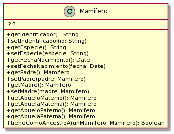

Ejercicio 21 - Genealogía salvaje

Retomamos el ejercicio de genealogía salvaje de Objetos 1, ahora utilizando los conceptos vistos en Objetos 2.

Se trata de una reserva de vida salvaje (como la estación de cría ECAS, en el camino Centenario), donde los cuidadores están interesados en llevar un registro detallado de los animales que cuidan y sus familias. Para ello nos han pedido ayuda.
El siguiente es un diagrama de clases inicial (incompleto) y nos da una idea de los mensajes que un mamífero entiende.

Tareas:
Complete el diagrama de clases para reflejar los atributos y relaciones requeridos.
Implemente completamente en Java. Si utiliza algún patrón de diseño, indique cuál.
