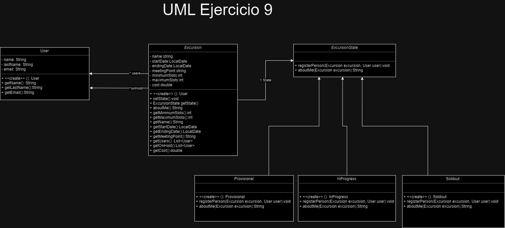

Ejercicio 9:

- Excursiones
  Sea una aplicación que ofrece excursiones como por ejemplo “dos días en kayak bajando el Paraná”. Una excursión posee nombre, fecha de inicio, fecha de fin, punto de encuentro, costo, cupo mínimo y cupo máximo.
  La aplicación ofrece las excursiones pero éstas sólo se realizan si alcanzan el cupo mínimo de inscriptos. Un usuario se inscribe a una excursión y si aún no se alcanzó el cupo mínimo, la inscripción se considera provisoria. Luego, cuando se alcanza el cupo mínimo, la inscripción se considera definitiva y podrá llevarse a cabo. Finalmente, cuando se alcanza el cupo máximo, la excursión solo registrará nuevos inscriptos en su lista de espera.
  De los usuarios inscriptos, la aplicación registra su nombre, apellido e email.

- Por otro lado, en todo momento la excursión ofrece información de la misma, la cual consiste en una serie de datos que varían en función de la situación.

- Si la excursión no alcanza el cupo mínimo, la información es la siguiente: nombre, costo, fechas, punto de encuentro, cantidad de usuarios faltantes para alcanzar el cupo mínimo.

- Si la excursión alcanzó el cupo mínimo pero aún no el máximo, la información es la siguiente: nombre, costo, fechas, punto de encuentro, los mails de los usuarios inscriptos y cantidad de usuarios faltantes para alcanzar el cupo máximo.

- Si la excursión alcanzó el cupo máximo, la información solamente incluye nombre, costo, fechas y punto de encuentro.

- En una primera versión, al no contar con una interfaz de usuario y a los efectos de debugging, este comportamiento puede implementarlo en un método que retorne un String con la información solicitada.

Tareas:

1 - Realice un diseño UML. Si utiliza algún patrón indique cuál(es) y justifique su uso.
2 - Implemente lo necesario para instanciar una excursión y para instanciar un usuario.
3 - Implemente los siguientes mensajes de la clase Excursion:

(i) public void inscribir (Usuario unUsuario)

(ii) public String obtenerInformacion().

4 - Escriba un test para inscribir a un usuario en la excursión “Dos días en kayak bajando el Paraná”, con cupo mínimo de 1 persona y cupo máximo 2, con dos personas ya inscriptas. Implemente todos los mensajes que considere necesarios.

